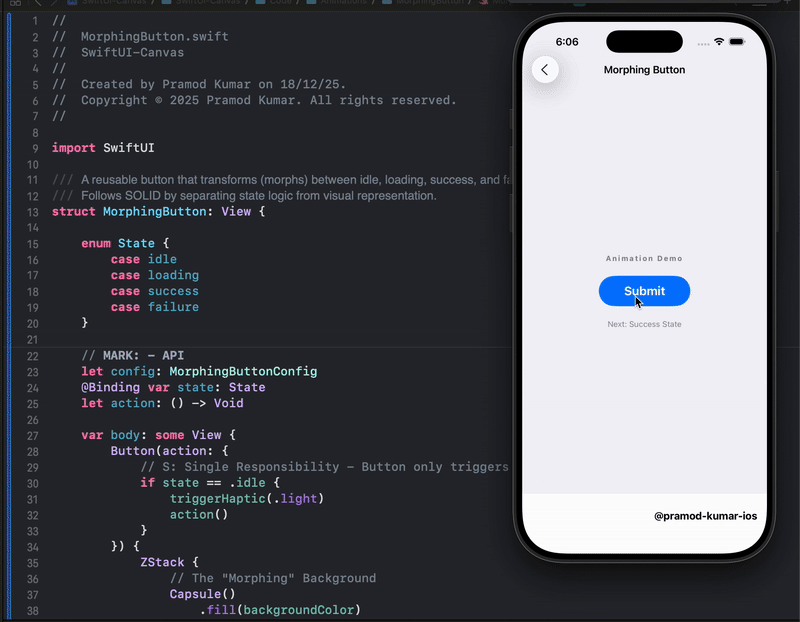
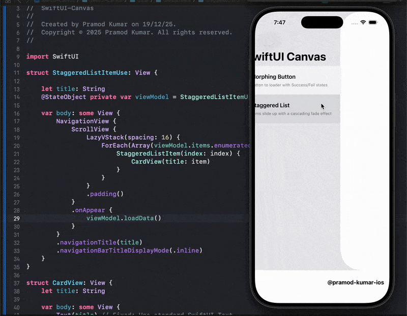
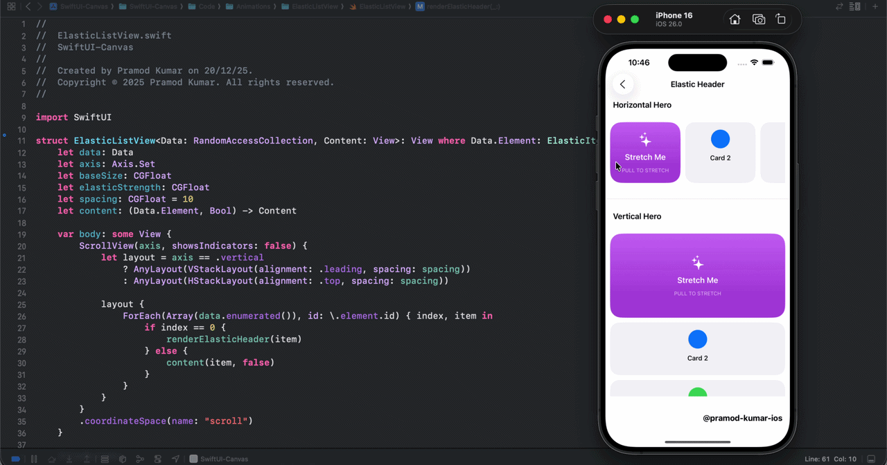
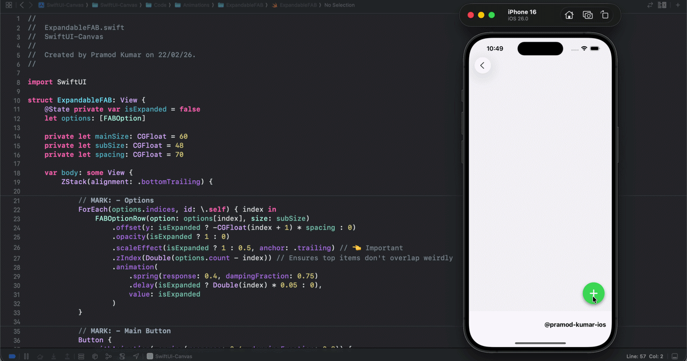

# 🎨 SwiftUI Canvas

**Production-grade SwiftUI animations**  
*Where clean code becomes motion.*

---

Hello there 👋🏻, I’m **Pramod Kumar** — a **Senior iOS Engineer & SwiftUI Advocate (10+ yrs)** focused on **animations, motion design, and performance-driven UI systems**.

**SwiftUI Canvas** is an open-source collection of **high-quality, production-ready SwiftUI animations and interaction patterns**.  
Each example is carefully crafted to demonstrate:

- ✅ Clean state management  
- ✅ Performance-safe rendering  
- ✅ Smooth, system-native transitions  
- ✅ Real-world usability — not just visual flair  

✨ Built for **learning**, **inspiration**, and **real-world production use**.

> 🎯 **Goal:**  
> Help iOS developers deeply understand SwiftUI animations and motion systems — and apply them confidently in scalable, production apps.

If you enjoy these animations or learn something new, feel free to ⭐️ the repository and use these concepts in your own projects.

---

## 🔗 Connect With Me

---

## ✨ Animations

Below is a growing collection of **production-ready SwiftUI animations** available in **SwiftUI Canvas**.  
All examples are **modular, reusable, and easy to integrate** into real apps.

---

### 🔄 Morphing Button

Button → Loader → Success/Failure states with spring animations and tactile visual feedback.

  

🔗 **[View Code](https://github.com/pramod-kumar-ios/SwiftUI-Canvas/tree/main/SwiftUI-Canvas/Code/Animations/MorphingButton)**

---

### 📶 Staggered List

List items animate upward with cascading fade transitions on appear.

  

🔗 **[View Code](https://github.com/pramod-kumar-ios/SwiftUI-Canvas/tree/main/SwiftUI-Canvas/Code/Animations/StaggeredListItem)**

---

### 🎢 Elastic List View

The header image stretches and bounces with a spring effect when the user pulls down on the scroll view.

  

🔗 **[View Code](https://github.com/pramod-kumar-ios/SwiftUI-Canvas/tree/main/SwiftUI-Canvas/Code/Animations/ElasticListView)**

---
### 🫧 Expandable FAB

A floating action button that reveals a staggered menu of options. Buttons pop out from behind the main trigger with smooth scaling and trailing-edge alignment.

  

🔗 **[View Code](https://github.com/pramod-kumar-ios/SwiftUI-Canvas/tree/main/SwiftUI-Canvas/Code/Animations/ExpandableFAB)**

---

## 🧠 Who This Is For

- iOS developers learning SwiftUI animations  
- Teams prototyping motion systems  
- Engineers validating UI performance  
- Portfolio & interview showcases  

---

## 🌟 Spread the Word

If this project helped you:

- ⭐️ Star the repository  
- 🔁 Share it with the SwiftUI & iOS developer community  
- 🧠 Use these animation patterns in your own apps  

Your support motivates me to keep building and sharing ✨

---

## 📄 License

This project is licensed under the **MIT License** — free to use, modify, and distribute with attribution.

---

### © 2025 Pramod Kumar  
*SwiftUI Canvas — where clean code becomes motion.*
